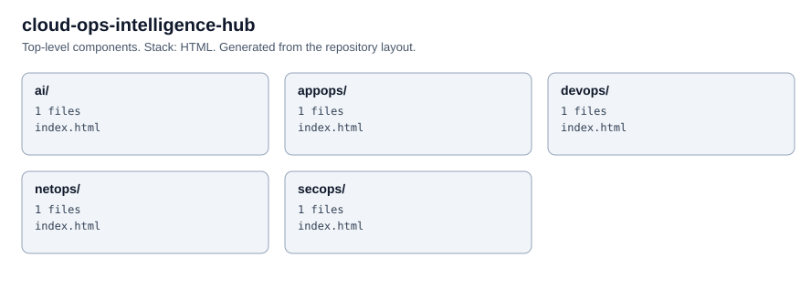

# Cloud Operations Intelligence Hub

Static pages covering network operations, security operations, application operations, DevOps and AI operations.

Open `index.html` in a browser. Each area has its own folder: `netops/`, `appops/`, `devops/` and `ai/`. There is no build step.

<!-- project-structure -->
## Project structure

```text
├── ai/
│   └── index.html
├── appops/
│   └── index.html
├── devops/
│   └── index.html
├── netops/
│   └── index.html
├── secops/
│   └── index.html
├── .editorconfig
├── .gitattributes
├── CODEOWNERS
├── CONTRIBUTING.md
├── LICENSE
├── README.md
├── SECURITY.md
├── index.html
├── linkedin-posts.html
└── post-01.html
```

<!-- architecture -->
## Architecture


